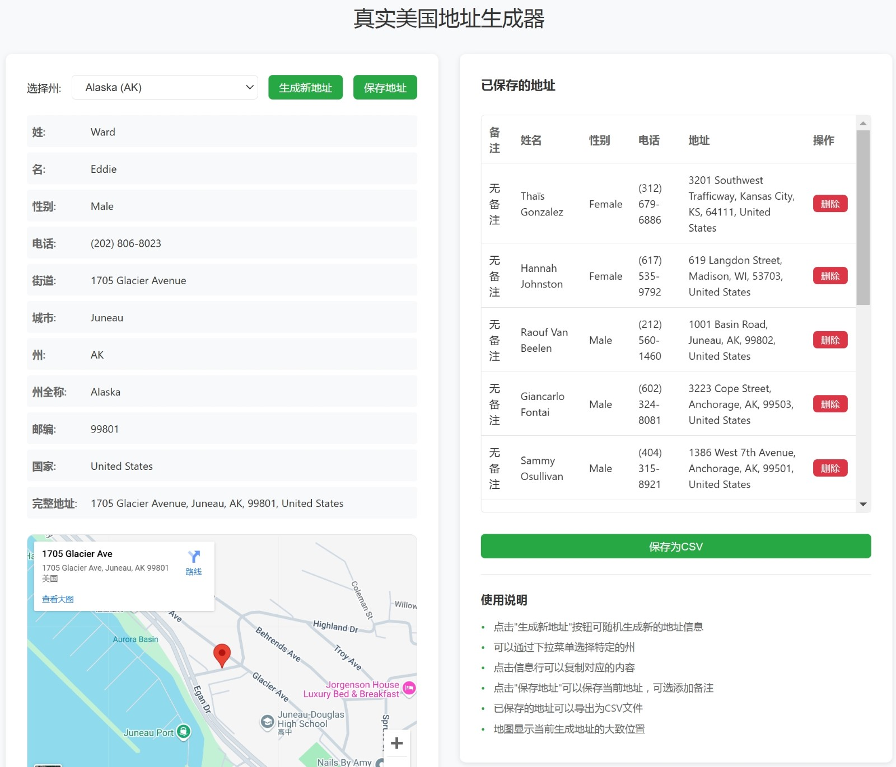

#美国地址生成器

[English](./README_EN.md) | 简体中文

## 项目介绍
这是一个基于 Cloudflare Workers 的地址生成器，可以生成真实的美国地址、姓名、性别和电话号码。本项目在原有基础上增加了部分功能，优化了用户体验。

## 演示地址
在线使用：https://usaddressgen.com

## 预览
### 桌面端

### 移动端

## 主要功能
- 生成真实存在的美国地址（包含门牌号、街道、城市、州和邮编）
- 生成随机的真实姓名（支持多族裔）
- 生成对应州的区号电话号码
- 支持指定州生成地址
- 在 Google Maps 中显示地址位置
- 一键复制各项信息
- 支持保存地址和添加备注
- 支持导出为 CSV 文件
- 优化移动端适配
- 自动跟随系统的暗色模式

## 技术特点
- 使用 Cloudflare Workers 部署，快速且稳定
- 使用 OpenStreetMap API 获取真实地址
- 使用 Google Maps 显示地址位置
- 纯原生 JavaScript 实现，无需额外依赖
- 响应式设计，支持各种设备

## 部署说明
1. 注册或登录 Cloudflare 账号
2. 创建新的 Worker
3. 复制 `worker.js` 中的代码到 Worker 编辑器
4. 保存并部署

## 使用说明
1. 打开网页后自动生成随机地址
2. 可以通过下拉菜单选择特定的州
3. 点击"生成新地址"按钮生成新的地址
4. 点击任意信息行可以复制对应内容
5. 点击"保存地址"可以保存当前地址
6. 可以为保存的地址添加备注
7. 可以将保存的地址导出为 CSV 文件
8. 可以在地图上查看地址的具体位置

## 改进功能
相比原版增加了以下功能：
- 支持保存多个地址
- 支持为地址添加备注
- 支持导出为 CSV 文件
- 优化了移动端显示
- 增加了暗色模式
- 增加了使用说明
- 优化了错误处理
- 增加了重试机制

## 注意事项
- 本项目生成的地址仅供学习和测试使用
- 请勿将生成的地址用于非法用途
- API 调用有频率限制，请合理使用

## 许可证
MIT License

## 版权声明
初代版本来自 chatgpt.org.uk，由 kxnotes 进行修改。
